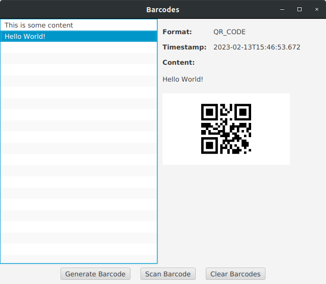

# Barcodes

This application allows you to scan barcodes using your webcam.

# Screenshots




## Prerequisites

The following is necessary to build and run this application.
- Java 17

## How to Build

```shell
./mvnw clean install
```

## How to Run

```shell
./mvnw clean javafx:run -pl app
```

### Simulation Mode

Running the application in simulation mode allows for easy and reliable testing as it can simulate none or some webcams.

```shell
./mvnw clean javafx:run -pl app -Dsimulation.enabled=true -Dsimulation.fakeWebcams=true
```
